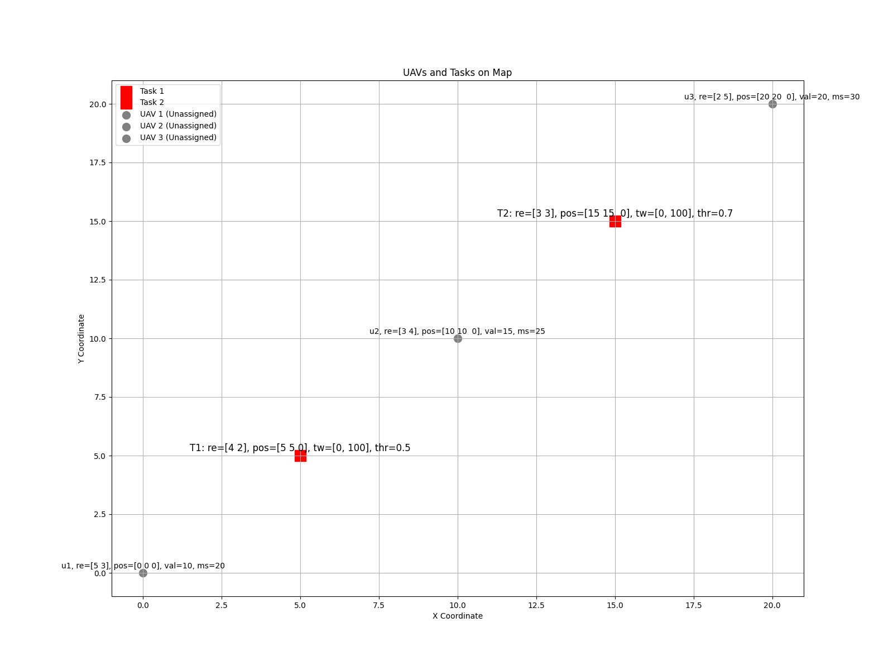
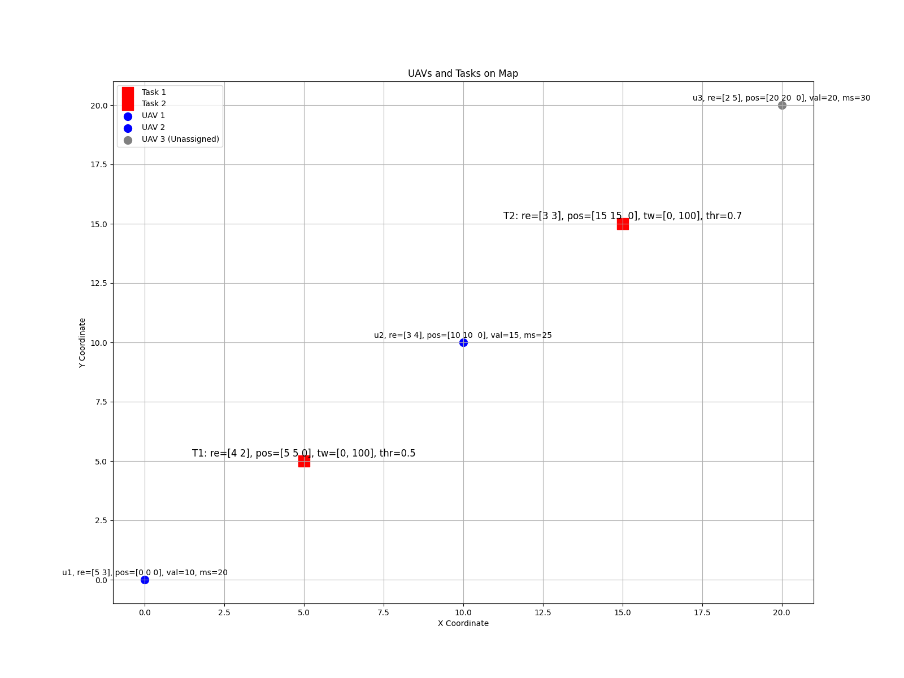

# Repotitory for Swarm UAV Task Assignment

- try to implement the algorithm in the [paper](https://doi.org/10.1360/ssi-2024-0167).

## Show Cases

<p align="center"> 
 
 
</p>

```python
resources_num = 2
map_shape = (20, 20, 0)
gamma = 0.1

# 初始化无人机
uav1 = UAV(1, [5, 3], [0, 0, 0], 10, 20)
uav2 = UAV(2, [3, 4], [10, 10, 0], 15, 25)
uav3 = UAV(3, [2, 5], [20, 20, 0], 20, 30)
uavs = [uav1, uav2, uav3]
uav_manager = UAVManager(uavs)
# 初始化任务
task1 = Task(1, [4, 2], [5, 5, 0], [0, 100], 0.5)
task2 = Task(2, [3, 3], [15, 15, 0], [0, 100], 0.7)
tasks = [task1, task2]
task_manager = TaskManager(tasks)
game = CoalitionFormationGame(
    uav_manager,
    task_manager,
    resources_num=resources_num,
    map_shape=map_shape,
    gamma=gamma,
)

game.plot_map()
final_coalitions = game.run(debug=False)
game.plot_map()
```

```bash
$ python src/sim.py
Assigning u1 to t1
Assigning u2 to t2
Checking stability for task 1, coalition: [u1]
Checking stability for task 2, coalition: [u2]
```

## TODO

- [ ] implement the algorithm in the [paper](https://doi.org/10.1360/ssi-2024-0167).
- [ ] fix bugs in CoalitionFormationGame task assignment algorithm.

## Structure

- `src/`:
  - `sim.py`: the main simulation script.
  - `game.py`: implement `CoalitionFormationGame`.
  - `task.py`: the class for `Task` and `TaskManager`.
  - `uav.py`: the class for `UAV` and `UAVManager`.
  - `coalition.py`: the class for `CoalitionSet`.
  - `utils.py`: the utility functions.
