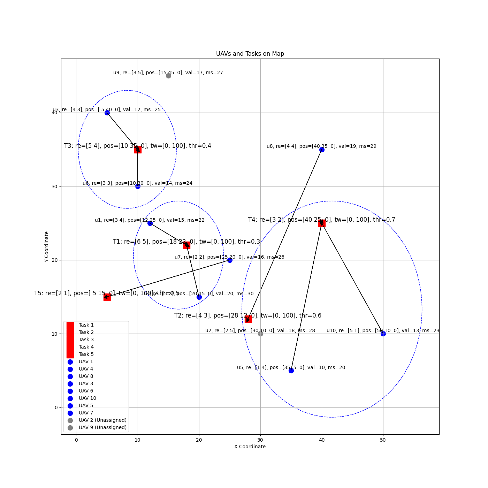

# Repotitory for Swarm UAV Task Assignment

## TODO

- [x] implement the algorithm in the [csci2024@薛舒心](https://doi.org/10.1360/ssi-2024-0167), `./solvers/csci.py`
  - [x] add time constraints
  - [ ] uavs and tasks cluster
- [x] fix bugs in CoalitionFormationGame task assignment algorithm.
- [x] Calculate various evaluation indicators, such as:
  - task completion rate, and resource use rate
- [x] Implement algorithm in [iros2024@LiwangZhang](https://doi.org/10.1109/IROS58592.2024.10801429), `./solvers/iros.py`
- [x] Implement algorithm in [icra2024@LiwangZhang](https://doi.org/10.1109/ICRA57147.2024.10611476), `./solvers/icra.py`
- Warning: iros2024@LiwangZhang and icra2024@LiwangZhang both need random sample in trigger uav stage! Otherwise, the alg may be vibrate and stuck in a deadlock.
- [ ] Implement Read/Write for solvers test results, using `pandas`.
- [ ] Test solver on one profile multiple times and draw the **box** fig.
- [ ] Implement Real Muti-Process simulation in [`./solvers/icra.py`](./solvers/icra2024.py).
- [ ] Mutiple MRAT Solver Algorithm Implment:
  - [ ] Acution Based Methods: Consensus-Based Bundle Algorithm (CBBA) and Contract Net Protocol (CNP)
  - [ ] Optimization Based Methods:
    - [ ] Deterministic Optimization: linear programming (LP), mixed-integer linear programming (MILP), and the Hungarian algorithm
    - [ ] Meta-heuristics: genetic algorithms (GA), simulated annealing (SA), and swarm intelligence
  - [ ] RL Based Methods
  - [ ] Hybrid Methods
- [ ] 算法复杂度分析。。。

## plot Cases

下图左侧为分配前示意图，右侧为联盟博弈分配得到的结果（简单样例 `case0.json`）。

<p align="center"> 
 
 
</p>

下图左侧为暴力搜索所得的最佳分配结果，右侧为联盟博弈得到的结果（`case1.json`）。

<p align="center"> 
 
 
</p>

`case3.json`(10 uavs, 5 tasks), 下图为联盟博弈分配得到的结果，暴力搜索没有在规定时间内得到结果。

<p align="center"> 
 
</p>

```bash
# vary uav nums
$ python ./main.py --test_case uav_num --choices all --random_test_times 25 --uav_nums 10 20 50 80 100

# vary task nums
$ python ./main.py --test_case task_num --choices iros csci --random_test_times 25 --task_nums 10 20 50 80 100

# vary hyper params
$ python ./main.py --test_case hyper_params.path_cost_weight --choices csci --random_test_times 10 --hp_values 1.0 2.0 4.0 8.0 16.0 50.0

# test case4.json
python ./main.py test --test_case ./test_cases/case4.json --choices csci

# test uav num
python ./main.py test --test_case uav_num --choices all --random_test_times 5 --uav_nums 10 20 40 80 --task_nums 20 -o ./.results/results_uav_num_all_0329.yaml
python ./main.py plot -f ./.results/results_uav_num_all_0329.yaml -x uav_num --labels all

# test task num
python ./main.py test --test_case task_num --choices all --random_test_times 5 --task_nums 10 20 40 80 --uav_nums 20 -o ./.results/results_task_num_all_0329.yaml
python ./main.py plot -f ./.results/results_task_num_all_0329.yaml -x task_num --labels all

# test hyper params
## 资源贡献权重
python ./main.py test --test_case hyper_params.resource_contribution_weight --choices all --random_test_times 10 --hp_values -10.0 -1.0 0.0 1.0 4.0 8.0 16.0 -o ./.results/results_hyper_params.resource_contribution_weight_all_0329.yaml
python ./main.py plot -f ./.results/results_hyper_params.resource_contribution_weight_all_0329.yaml -x hyper_params.resource_contribution_weight --labels all --show --save_dir ./.results/results_hyper_params.resource_contribution_weight_all_0329

## 路径成本权重
python ./main.py test --test_case hyper_params.path_cost_weight --choices all --random_test_times 10 --hp_values -10.0 -1.0 0.0 1.0 2.0 4.0 8.0 16.0 -o ./.results/results_hyper_params.path_cost_weight_all_0329.yaml
python ./main.py plot -f ./.results/results_hyper_params.path_cost_weight_all_0329.yaml -x hyper_params.path_cost_weight --labels all 

## 威胁权重
python ./main.py test --test_case hyper_params.threat_loss_weight --choices all --random_test_times 10 --hp_values -10.0 -1.0 0.0 1.0 4.0 8.0 16.0 -o ./.results/results_hyper_params_threat_loss_weight_all_0329.yaml
python ./main.py plot -f ./.results/results_hyper_params_threat_loss_weight_all_0329.yaml -x hyper_params.threat_loss_weight --labels all

python ./main.py test --test_case uav_num --choices all --random_test_times 25 --uav_nums 10 20 50 80 100 --task_nums 10

## 最大迭代次数
python ./main.py test --test_case hyper_params.max_iter --choices all --random_test_times 10 --hp_values 1 2 3 4 10 15 -o ./.results/results_hyper_params_max_iter_all_0329.yaml
python ./main.py plot -f ./.results/results_hyper_params_max_iter_all_0329.yaml -x hyper_params.max_iter --labels all


python ./main.py plot -f ./.results/results_uav_num_all.json -x uav_num --labels all
```

## Project Structure

- `src/`:

  - `base.py`: base class for the project.
  - `uav.py`: the class for `UAV` and `UAVManager`.
  - `task.py`: the class for `Task` and `TaskManager`.
  - `coalition.py`: the class for `CoalitionSet`.
  - `utils.py`: the utility functions.
  - `task_assign.py`: implement `EnumerationAlgorithm`.
  - `game.py`: implement `CoalitionFormationGame`.
  - `sim.py`: the main simulation script.
  - `gen.py`: generate test data, in json format.

- `tests/`
  - case0.json: 3 uavs, 2 tasks; no coalition.
  - case1.json: 5 uavs, 2 tasks.
  - case2.json: 5 uavs, 3 tasks.
  - case3.json: 10 uavs, 5 tasks.
  - case4.json: 50 uavs, 5 tasks.
