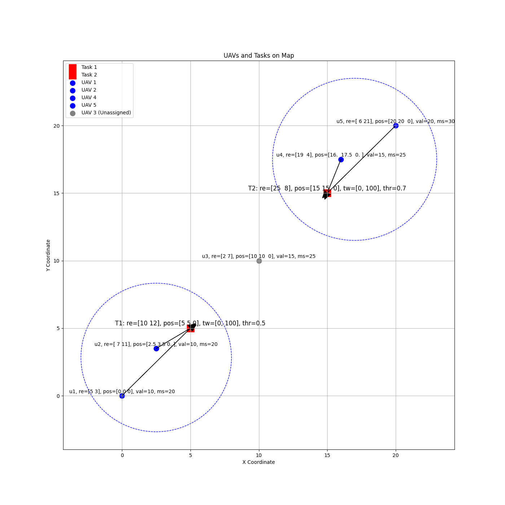
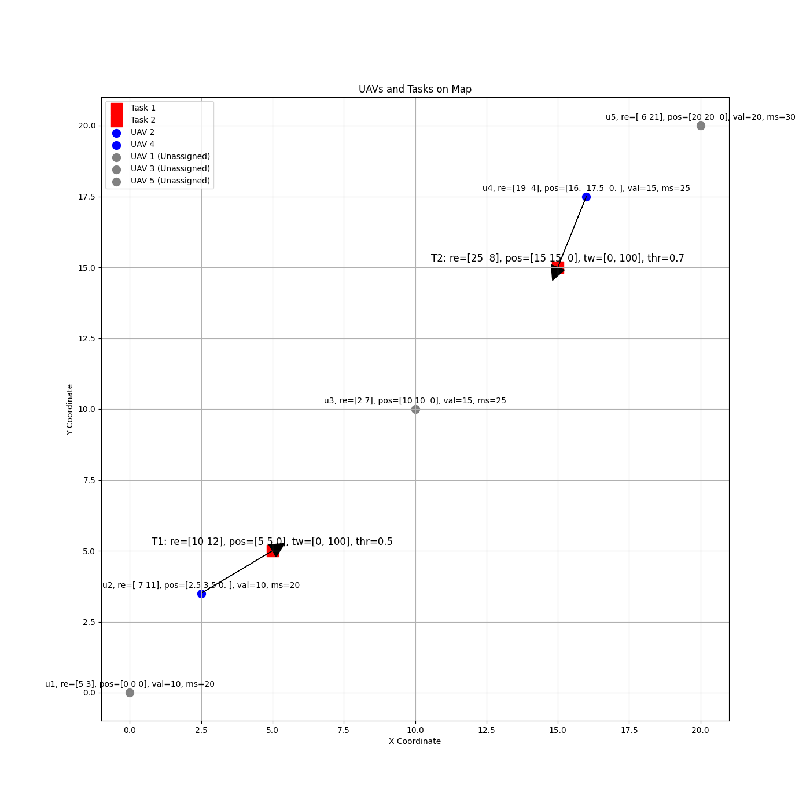

# Repotitory for Swarm UAV Task Assignment

- try to implement the algorithm in the [paper](https://doi.org/10.1360/ssi-2024-0167).

## Show Cases

下图左侧为分配前示意图，右侧为联盟博弈分配得到的结果（简单样例 `case0.json`）。

<p align="center"> 
 
 
</p>

下图左侧为暴力搜索所得的最佳分配结果，右侧为联盟博弈得到的结果（`case1.json`, 目前仍存在问题）。

<p align="center"> 
 
 
</p>


```python
resources_num = 2
map_shape = (20, 20, 0)
gamma = 0.1

with open(test_case_path, "r") as f:
    data = json.load(f)

uav_manager = UAVManager.from_dict(data["uavs"])
task_manager = TaskManager.from_dict(data["tasks"])

coalition_set = CoalitionSet(uav_manager, task_manager)
game = CoalitionFormationGame(
    uav_manager,
    task_manager,
    coalition_set,
    resources_num=resources_num,
    map_shape=map_shape,
    gamma=gamma,
)

# coalition_set.plot_map()
game.run(debug=False)
print("Coalition Game Result")
print(coalition_set)
coalition_set.plot_map()


print("Enumeration")
enumeration_algorithm = EnumerationAlgorithm(
    uav_manager,
    task_manager,
    resources_num=resources_num,
    map_shape=map_shape,
    gamma=gamma,
)
best_assignment, best_score = enumeration_algorithm.solve()

print(f"Best Assignment: {best_assignment}")
print(f"Best Score: {best_score}")

coalition_set = CoalitionSet(uav_manager, task_manager, assignment=best_assignment)
coalition_set.plot_map()

```

```bash
$ python sim.py --test_case ../tests/case1.json

Using test case: ../tests/case1.json
UAVManager managing 5 UAVs
  u1, re=[5 3], pos=[0 0 0], val=10, ms=20
  u2, re=[ 7 11], pos=[2.5 3.5 0. ], val=10, ms=20
  u3, re=[2 7], pos=[10 10  0], val=15, ms=25
  u4, re=[19  4], pos=[16.  17.5  0. ], val=15, ms=25
  u5, re=[ 6 21], pos=[20 20  0], val=20, ms=30
TaskManager with 2 tasks.
  T1: re=[10 12], pos=[5 5 0], tw=[0, 100], thr=0.5
  T2: re=[25  8], pos=[15 15  0], tw=[0, 100], thr=0.7
---
Coalition Game
Iteration 0 begin.
Cur coalition set: {1: [], 2: [], None: [1, 2, 3, 4, 5]}
check_stability True, Iteration 1 end.
Coalition Game Result: {1: [2], 2: [4], None: [1, 3, 5]}
---
Enumeration
All 243 assignments:
Best Assignment: {1: [1, 2], 2: [4, 5]}
Best Score: 54.851725195536254
```

## TODO

- [ ] implement the algorithm in the [paper](https://doi.org/10.1360/ssi-2024-0167).
- [ ] fix bugs in CoalitionFormationGame task assignment algorithm.

## Structure

- `src/`:
  - `sim.py`: the main simulation script.
  - `game.py`: implement `CoalitionFormationGame`.
  - `task.py`: the class for `Task` and `TaskManager`.
  - `uav.py`: the class for `UAV` and `UAVManager`.
  - `coalition.py`: the class for `CoalitionSet`.
  - `utils.py`: the utility functions.
