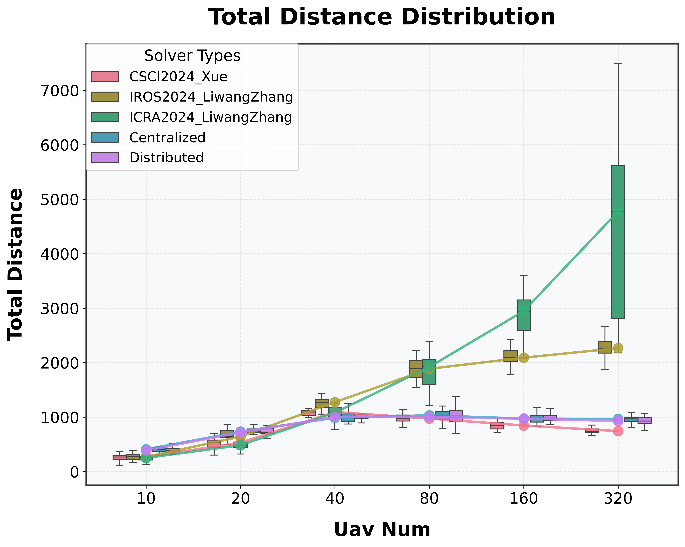
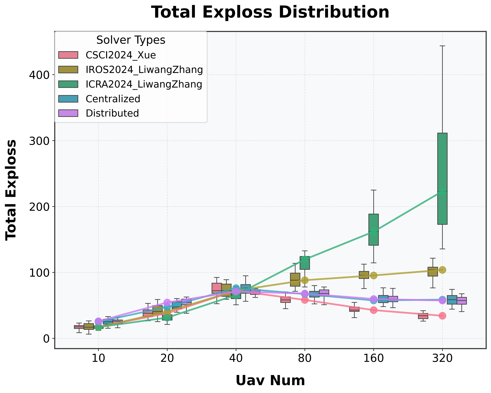

# Repotitory for Swarm UAV Task Assignment

## TODO

- [x] implement the algorithm in the [csci2024@薛舒心](https://doi.org/10.1360/ssi-2024-0167), `./solvers/csci.py`
  - [x] add time constraints
  - [ ] uavs and tasks cluster
- [x] fix bugs in CoalitionFormationGame task assignment algorithm.
- [x] Calculate various evaluation indicators, such as:
  - task completion rate, and resource use rate
- [x] Implement algorithm in [iros2024@LiwangZhang](https://doi.org/10.1109/IROS58592.2024.10801429), `./solvers/iros.py`
- [x] Implement algorithm in [icra2024@LiwangZhang](https://doi.org/10.1109/ICRA57147.2024.10611476), `./solvers/icra.py`
- Warning: iros2024@LiwangZhang and icra2024@LiwangZhang both need random sample in trigger uav stage! Otherwise, the alg may be vibrate and stuck in a deadlock.
- [ ] Implement Read/Write for solvers test results, using `pandas`.
- [x] Test solver on one profile multiple times and draw the **box** fig.
- [ ] Implement Real Muti-Process simulation in [`./solvers/icra.py`](./solvers/icra2024.py).
- [ ] Mutiple MRAT Solver Algorithm Implment:
  - [ ] Auction Based Methods: Consensus-Based Bundle Algorithm (CBBA) and Contract Net Protocol (CNP)
  - [ ] Optimization Based Methods:
    - [x] Deterministic Optimization: linear programming (LP), mixed-integer linear programming (MILP), and the Hungarian algorithm. [`milp_solver.py`](./solvers/milp_solver.py) and [`nlp_solver.py`](./solvers/nlp_solver.py)
    - [ ] Meta-heuristics: genetic algorithms (GA), simulated annealing (SA), and swarm intelligence
  - [ ] RL Based Methods
  - [ ] Hybrid Methods
- [x] 算法复杂度分析。。。
- [ ] Implement Overlapping CFG alg.

## How to run

该系统用于模拟和测试无人机集群任务分配算法，支持多种测试场景和可视化功能。

系统提供两个主要命令：`test` 和 `plot`。

### 1. 测试命令 (test)

用于运行算法测试，支持多种测试场景。

基本用法：

```bash
python main.py test [参数]
```

主要参数说明：

- `--test_case`: 测试用例类型或文件路径
  - 可选值：`uav_num`、`task_num`、`hyper_params.xxx` 或具体的测试文件路径
- `--uav_nums`: UAV 数量列表，默认为 [40]
- `--task_nums`: 任务数量列表，默认为 [20]
- `--hp_values`: 超参数值列表
- `--choices`: 要测试的算法列表
- `--timeout`: 每个算法的超时时间（秒），默认为 10
- `--random_test_times`: 随机测试次数，默认为 5
- `-o/--output`: 输出文件路径
- `--show`: 是否显示图表
- `--sim`: 是否时间步模拟运行（根据任务分配结果，无人机前往任务点并执行任务）
- `--save_dir`: 保存分配结果示意图的目录

示例：

```bash
# test
python ./main.py test --test_case ./test_cases/case4.json \
--choices csci centralized distributed \
--save_dir ./.image

# 测试不同 UAV 数量下的算法性能
python main.py test --test_case uav_num --uav_nums 20 40 60 --task_nums 20 --choices algorithm1 algorithm2

# 测试不同任务数量下的算法性能
python main.py test --test_case task_num --task_nums 10 20 30 --uav_nums 40 --choices algorithm1 algorithm2

# 测试超参数影响
python main.py test --test_case hyper_params.alpha --hp_values 0.1 0.2 0.3 --choices algorithm1

# 运行特定测试用例
python main.py test --test_case test_case.json --choices algorithm1 algorithm2
```

目前支持的算法包括：

```py
choices_to_class = {
    "enum": enum_solver.EnumerationSolver,
    "brute_force": brute_force_solver.BruteForceSearchSolver,
    "csci": csci2024.ChinaScience2024_CoalitionFormationGame,
    "iros": iros2024.IROS2024_CoalitionFormationGame,
    "iros2": iros2024.IROS2024_CoalitionFormationGame_2,
    "icra": icra2024.ICRA2024_CoalitionFormationGame,
    "auction": auction_solver.AuctionBiddingSolverAdvanced,
    "auction_kimi": auction_solver.AuctionBiddingSolverKimi,
    "milp": milp_solver.MILPSolver,
    "milp_pyomo": milp_solver.MILPSolverPyomo,
    "nlp_scipy": nlp_solver.NLPSolverScipy,
    "nlp_pyomo": nlp_solver.NLPSolverPyomo,
    "centralized": centralized_solver.CentralizedSolver,
    "centralized_random_init": centralized_solver.CentralizedSolver_RandomInit,
    "centralized_selfish": centralized_solver.CentralizedSolver_Selfish,
    "centralized_pareto": centralized_solver.CentralizedSolver_Pareto,
    "distributed": distributed_solver.DistributedSolver,
    "distributed_random_init": distributed_solver.DistributedSolver_RandomInit,
    "distributed_selfish": distributed_solver.DistributedSolver_Selfish,
    "distributed_pareto": distributed_solver.DistributedSolver_Pareto,
}
```

### 2. 绘图命令 (plot)

用于可视化测试结果。

基本用法：

```bash
python main.py plot [参数]
```

主要参数说明：

- `-f/--file_path`: 结果文件路径
- `-x/--xlabel`: X 轴标签，默认为 "uav_num"
- `--labels`: 要显示的指标列表，默认为 ["elapsed_time"]
  - 可选值：elapsed_time（运行时间）、completion_rate（完成率）、resource_use_rate（资源使用率）、total_distance（总距离）、total_energy（总能量）、total_exploss（总损失）
- `--choices`: 要显示的算法列表
- `--save_dir`: 图表保存目录
- `--show`: 是否显示图表

示例：

```bash
# 显示运行时间对比
python main.py plot -f results.yaml --labels elapsed_time --choices algorithm1 algorithm2

# 显示多个指标
python main.py plot -f results.yaml --labels elapsed_time completion_rate --choices algorithm1 algorithm2

# 显示所有指标
python main.py plot -f results.yaml --labels all --choices algorithm1 algorithm2
```

### 其他说明

测试结果将保存在 `./.results/` 目录下，文件名格式为 `results_{test_case_name}_{algorithm_names}.yaml`。

1. 运行测试前请确保已安装所有必要的依赖包
2. 使用 `--show` 参数可以在测试或绘图时直接显示结果图表
3. 对于超参数测试，必须提供 `hp_values` 参数
4. 绘图时可以使用 `all` 作为 labels 参数来显示所有可用指标

## 测试结果示意图

### Case4: `./test_cases/case4.json`

<!-- Centralized_case4
Distributed_case4
CSCI2024_Xue_case4
ICRA2024_LiwangZhang_case4
IROS2024_LiwangZhang_case4 -->

left: Centralized; right: Distributed

<p align="center"> 
 
 
</p>

left: IROS2024_LiwangZhang; right: ICRA2024_LiwangZhang

<p align="center"> 
 
 
</p>

CSCI2024_Xue_case4

<p align="center"> 
 
</p>

### Ramdom Test and Compare

#### 改变无人机数量：

<p align="center"> 
 
 
</p>

<p align="center"> 
 
 
</p>

<p align="center"> 
 
 
</p>

#### 改变任务数量：

<p align="center"> 
 
 
</p>

<p align="center"> 
 
 
</p>

<p align="center"> 


</p>

#### 改变超参数: 资源贡献权重 `resource_contribution_weight`

<!-- dir: results_hyper_params.resource_contribution_weight_all_0519 -->

<p align="center"> 


</p>

<p align="center"> 


</p>

<p align="center"> 


</p>

#### 改变超参数: 路径成本权重 `path_cost_weight`

<!-- dir: results_hyper_params.path_cost_weight_all_0519 -->

<p align="center"> 


</p>

<p align="center"> 


</p>

<p align="center"> 


</p>

#### 消融实验: 最大加权匹配初始化 vs 随机初始化

<!-- uav_num_all_ablation_0519 -->

<p align="center"> 
 
 
</p>

<p align="center"> 
 
 
</p>

<p align="center"> 


</p>

#### 偏好关系对比实验

<!-- uav_num_all_preference_0519 -->

<p align="center">


</p>

<p align="center">


</p>

<p align="center">


</p>

## Project Structure

### 1. framework 目录

核心框架实现，包含基础组件和功能模块。

```bash
framework/
├── __init__.py           # 包初始化文件
├── base.py               # 基础类和接口定义
├── task.py               # 任务相关定义
├── uav.py                # UAV（无人机）相关定义
├── coalition_manager.py  # 联盟管理模块
├── mrta_solver.py        # 多机器人任务分配求解器
├── sim.py                # 时间步模拟
├── test.py               # 测试框架
└── utils.py              # 工具函数
```

- `base.py`: 定义系统的基础类和接口
- `coalition_manager.py`: 负责管理无人机联盟的形成和协调
- `mrta_solver.py`: 多机器人任务分配问题的求解器接口
- `sim.py`: 系统仿真模块，用于模拟无人机集群的运行
- `task.py`: 定义任务相关的数据结构和操作
- `test.py`: 测试框架，用于评估算法性能
- `uav.py`: 定义无人机相关的属性和行为
- `utils.py`: 提供各种工具函数

### 2. solvers 目录

包含各种任务分配算法的实现。

```bash
solvers/
├── __init__.py           # 包初始化文件
├── driver.py             # 求解器驱动模块
├── csci2024.py           # CSCI 2024 算法实现
├── iros2024.py           # IROS 2024 算法实现
├── icra2024.py           # ICRA 2024 算法实现
├── centralized_solver.py # 集中式求解器
├── distributed_solver.py # 分布式求解器
├── auction_solver.py     # 拍卖算法求解器
├── enum_solver.py        # 枚举求解器
├── milp_solver.py        # 混合整数线性规划求解器
├── nlp_solver.py         # 非线性规划求解器
├── brute_force_solver.py # 暴力求解器
└── utils.py              # 工具函数
```

- `auction_solver.py`: 实现基于拍卖机制的任务分配算法
- `brute_force_solver.py`: 实现暴力搜索算法
- `centralized_solver.py`: 实现集中式任务分配算法
- `distributed_solver.py`: 实现分布式任务分配算法
- `driver.py`: 负责管理和调用不同的求解器
- `milp_solver.py`: 实现混合整数线性规划算法
- `nlp_solver.py`: 实现非线性规划算法
- `csci2024.py`/`icra2024.py`/`iros2024.py`: 特定会议论文的算法实现

1. 开发新算法时，建议在 `solvers` 目录下创建新的求解器文件
2. 修改核心功能时，主要关注 `framework` 目录下的相关模块
3. 测试新算法时，使用 `framework/test.py` 提供的测试框架
4. 工具函数可以根据需要放在对应目录的 `utils.py` 中

5. 添加新的求解器时，需要确保在 `solvers/__init__.py` 和 `solvers/driver.py` 中正确注册
6. 修改核心接口时，需要确保向后兼容性
7. 建议遵循项目的代码风格和命名规范
8. 在添加新功能时，注意更新相应的测试用例

---

- `src/`:

  - `base.py`: base class for the project.
  - `uav.py`: the class for `UAV` and `UAVManager`.
  - `task.py`: the class for `Task` and `TaskManager`.
  - `coalition.py`: the class for `CoalitionSet`.
  - `utils.py`: the utility functions.
  - `task_assign.py`: implement `EnumerationAlgorithm`.
  - `game.py`: implement `CoalitionFormationGame`.
  - `sim.py`: the main simulation script.
  - `gen.py`: generate test data, in json format.

- `tests/`
  - case0.json: 3 uavs, 2 tasks; no coalition.
  - case1.json: 5 uavs, 2 tasks.
  - case2.json: 5 uavs, 3 tasks.
  - case3.json: 10 uavs, 5 tasks.
  - case4.json: 50 uavs, 5 tasks.

## Reference Commands

```bash
# vary uav nums
$ python ./main.py --test_case uav_num --choices all --random_test_times 25 --uav_nums 10 20 50 80 100

# vary task nums
$ python ./main.py --test_case task_num --choices iros csci --random_test_times 25 --task_nums 10 20 50 80 100

# vary hyper params
$ python ./main.py --test_case hyper_params.path_cost_weight --choices csci --random_test_times 20 --hp_values 1.0 2.0 4.0 8.0 16.0 50.0

# test case4.json
python ./main.py test --test_case ./test_cases/case4.json --choices csci

# test uav num
python ./main.py test --test_case uav_num --choices all --random_test_times 5 --uav_nums 10 20 40 80 --task_nums 20 -o ./.results/results_uav_num_all_0329.yaml
python ./main.py plot -f ./.results/results_uav_num_all_0329.yaml -x uav_num --labels all

# test task num
python ./main.py test --test_case task_num --choices all --random_test_times 5 --task_nums 10 20 40 80 --uav_nums 20 -o ./.results/results_task_num_all_0329.yaml
python ./main.py plot -f ./.results/results_task_num_all_0329.yaml -x task_num --labels all

# test hyper params
## 资源贡献权重
python ./main.py test --test_case hyper_params.resource_contribution_weight --choices all --random_test_times 20 --hp_values -10.0 -1.0 0.0 1.0 4.0 8.0 16.0 -o ./.results/results_hyper_params.resource_contribution_weight_all_0329.yaml
python ./main.py plot -f ./.results/results_hyper_params.resource_contribution_weight_all_0329.yaml -x hyper_params.resource_contribution_weight --labels all --show --save_dir ./.results/results_hyper_params.resource_contribution_weight_all_0329

## 路径成本权重
python ./main.py test --test_case hyper_params.path_cost_weight --choices all --random_test_times 20 --hp_values -10.0 -1.0 0.0 1.0 2.0 4.0 8.0 16.0 -o ./.results/results_hyper_params.path_cost_weight_all_0329.yaml
python ./main.py plot -f ./.results/results_hyper_params.path_cost_weight_all_0329.yaml -x hyper_params.path_cost_weight --labels all

## 威胁权重
python ./main.py test --test_case hyper_params.threat_loss_weight --choices all --random_test_times 20 --hp_values -10.0 -1.0 0.0 1.0 4.0 8.0 16.0 -o ./.results/results_hyper_params_threat_loss_weight_all_0329.yaml
python ./main.py plot -f ./.results/results_hyper_params_threat_loss_weight_all_0329.yaml -x hyper_params.threat_loss_weight --labels all

python ./main.py test --test_case uav_num --choices all --random_test_times 25 --uav_nums 10 20 50 80 100 --task_nums 10

## 最大迭代次数
python ./main.py test --test_case hyper_params.max_iter --choices all --random_test_times 20 --hp_values 1 2 3 4 10 15 -o ./.results/results_hyper_params_max_iter_all_0329.yaml
python ./main.py plot -f ./.results/results_hyper_params_max_iter_all_0329.yaml -x hyper_params.max_iter --labels all


python ./main.py plot -f ./.results/results_uav_num_all.json -x uav_num --labels all

# test uav num
python ./main.py test --test_case uav_num --choices centralized csci --random_test_times 5 --uav_nums 10 20 40 80 160 --task_nums 20 -o ./.results/results_uav_num_0516.yaml
python ./main.py plot -f ./.results/results_uav_num_0516.yaml -x uav_num --labels all


# 0518
## uav num
python ./main.py test --test_case uav_num --choices csci iros icra centralized distributed --random_test_times 20 --uav_nums 10 20 40 80 160 320 --task_nums 30 -o ./.results/results_uav_num_0518.yaml

python ./main.py plot -f ./.results/results_uav_num_all_0518.yaml -x uav_num --labels all --choices CSCI2024_Xue IROS2024_LiwangZhang ICRA2024_LiwangZhang Centralized Distributed --save_dir ./.results/uav_num_all_0518/  --show

## task num
python ./main.py test --test_case task_num --choices csci iros icra centralized distributed --random_test_times 20 --uav_nums 40  --task_nums 10 20 40 80 160 -o ./.results/results_task_num_0518.yaml

python ./main.py plot -f ./.results/results_task_num_0518.yaml -x task_num --labels all --choices CSCI2024_Xue IROS2024_LiwangZhang ICRA2024_LiwangZhang Centralized Distributed --save_dir ./.results/task_num_all_0518/  --show

## hyper params
### resource contribution weight
python ./main.py test --test_case hyper_params.resource_contribution_weight --choices all --random_test_times 20 --hp_values -64.0 -10.0 -1.0 0.0 1.0 4.0 8.0 16.0 64.0 -o ./.results/results_hyper_params.resource_contribution_weight_all_0519.yaml

python ./main.py plot -f ./.results/results_hyper_params.resource_contribution_weight_all_0519.yaml -x hyper_params.resource_contribution_weight --labels all --choices CSCI2024_Xue IROS2024_LiwangZhang ICRA2024_LiwangZhang Centralized Distributed  --show --save_dir ./.results/results_hyper_params.resource_contribution_weight_all_0519

### path cost weight
python ./main.py test --test_case hyper_params.path_cost_weight --choices all --random_test_times 20 --hp_values -10.0 -1.0 0.0 1.0 4.0 8.0 16.0 64.0 -o ./.results/results_hyper_params.path_cost_weight_all_0519.yaml

python ./main.py plot -f ./.results/results_hyper_params.path_cost_weight_all_0519.yaml -x hyper_params.path_cost_weight --labels all --show --save_dir ./.results/results_hyper_params.path_cost_weight_all_0519

### threat loss weight
python ./main.py test --test_case hyper_params.threat_loss_weight --choices all --random_test_times 20 --hp_values -10.0 -1.0 0.0 1.0 4.0 8.0 16.0 64.0 -o ./.results/results_hyper_params.threat_loss_weight_all_0519.yaml

python ./main.py plot -f ./.results/results_hyper_params.threat_loss_weight_all_0519.yaml -x hyper_params.threat_loss_weight --labels all --show --save_dir ./.results/results_hyper_params.threat_loss_weight_all_0519

### resource waste weight
python ./main.py test --test_case hyper_params.resource_waste_weight --choices centralized distributed --random_test_times 20 --hp_values -10.0 -1.0 0.0 1.0 4.0 8.0 16.0 64.0 -o ./.results/results_hyper_params.resource_waste_weight_all_0519.yaml

python ./main.py plot -f ./.results/results_hyper_params.resource_waste_weight_all_0519.yaml -x hyper_params.resource_waste_weight --labels all --show --save_dir ./.results/results_hyper_params.resource_waste_weight_all_0519

## example [TODO]

## Ablation Study
### uav num
python ./main.py test --test_case uav_num --choices centralized distributed centralized_random_init distributed_random_init --random_test_times 20 --uav_nums 10 20 40 80 160 320 --task_nums 30 -o ./.results/results_uav_num_ablation_0519.yaml

python ./main.py plot -f ./.results/results_uav_num_ablation_0519.yaml -x uav_num --labels all --save_dir ./.results/uav_num_all_ablation_0519/  --show

### task num
python ./main.py test --test_case task_num --choices centralized distributed centralized_random_init distributed_random_init --random_test_times 20 --uav_nums 40  --task_nums 10 20 40 80 160 -o ./.results/results_task_num_ablation_0519.yaml

python ./main.py plot -f ./.results/results_task_num_ablation_0519.yaml -x task_num --labels all --save_dir ./.results/task_num_all_ablation_0519/  --show

### preference
python ./main.py test --test_case uav_num --choices centralized centralized_selfish centralized_pareto distributed distributed_selfish distributed_pareto --random_test_times 20 --uav_nums 10 20 40 80 --task_nums 30 -o ./.results/results_uav_num_preference_0519.yaml

python ./main.py plot -f ./.results/results_uav_num_preference_0519.yaml -x uav_num --labels all  --save_dir ./.results/uav_num_all_preference_0519/
--show

## hyper params
### resource contribution weight
python ./main.py test --test_case uav_num --choices  centralized_selfish centralized_pareto  distributed_selfish distributed_pareto --random_test_times 1 --uav_nums 80  --task_nums 30
```

```py
all_labels = [
    "elapsed_time",
    "completion_rate",
    "resource_use_rate",
    "total_distance",
    "total_energy",
    "total_exploss",
]
```
